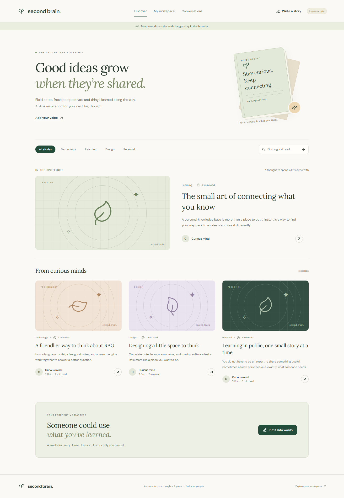

# Second Brain

A full-stack(MERN) evolution of Blog-page with a separate Python RAG service.



## What works

- **Accounts:** registration, login, JWT in HttpOnly cookies, bcrypt password hashing, session revocation on logout, and protected APIs.
- **Knowledge:** upload text PDFs, Markdown, text and code; write notes; organize by project and tags; inspect indexing status, retry failures, download originals, and delete sources.
- **RAG chat:** GPT-4o-mini answers grounded in ChromaDB retrieval. Documents **and queries** use OpenAI **text-embedding-3-large**. Answers include source cards with PDF pages or text/code line ranges. Conversations persist, including follow-up context.
- **Search:** semantic, keyword, and hybrid retrieval with reciprocal rank fusion.
- **Live chat:** private user-to-user Socket.IO conversations, authenticated connections, typing indicators, persisted history, reconnection, message acknowledgments and deduplication.
- **Stories:** public feed with search, topics and pagination; full article pages; private drafts; Markdown writing and preview; cover themes; publish/unpublish; editing conflict protection; comments and author moderation; copy a story into your private knowledge library.
- **Pages:** `/login`, `/signup`, `/blogs`, `/blogs/:id`, `/write`, `/blogs/:id/edit`, `/my-blogs`, `/workspace`, `/workspace/:conversationId`, `/knowledge`, `/projects`, `/search`, `/messages`, `/messages/:roomId`, and `/settings`. Refreshable URLs and protected-route redirects.
- **Interface:** responsive cream/sage theme, locally bundled DM Sans and Lora fonts, Markdown answers, keyboard-friendly dialogs, mobile navigation, copy-answer actions and honest empty/error states.
- **Sample workspace:** explicit browser-only preview with sample notes and extractive replies. It does not impersonate a live AI service or live users.


```powershell
npm install
npm install --prefix Frontend
npm run env:setup
python -m venv .venv
.\.venv\Scripts\python.exe -m pip install -r rag_service/requirements.txt
```

Open the local `.env` file and set **OPENAI_API_KEY**. The setup command creates fresh JWT and service secrets and does not overwrite an existing configuration. Keep this file private; never put the key in React code or commit it.

Start the Python service in one terminal:

```powershell
.\.venv\Scripts\python.exe -m uvicorn main:app --app-dir rag_service --host 127.0.0.1 --port 8001
```

Start the app in another:

```powershell
npm run dev:local
```
## Docker alternative

After generating `.env` and setting the key:

```powershell
docker compose up --build
```

Open **http://localhost:8000**. Compose persists MongoDB, uploads and ChromaDB in named volumes. Only the web app is published, bound to localhost. The file uses development cookie settings for local HTTP. For public hosting, configure HTTPS, `NODE_ENV=production`, explicit `CLIENT_ORIGIN`, authenticated MongoDB and infrastructure described in `docs/ARCHITECTURE.md`.

## Build and verify

```powershell
npm run build
npm test
.\.venv\Scripts\python.exe -m pytest rag_service -q
npm run lint --prefix Frontend
# Build first. Microsoft Edge must be installed; tests start an isolated app/database:
npm run test:ui

## Folder map

```text
Frontend/src/        React workspace, views, theme, API client and explicit sample mode
app.js               Express composition and startup
models/              Mongo users, original blogs, documents, projects, chats
routes/              Auth, knowledge, search, RAG, public stories and chat APIs
middleware/          JWT authorization
services/            Tokens, private ingestion, RAG HTTP client and Socket.IO
rag_service/         FastAPI, PDF/text processing, ChromaDB, OpenAI, Python tests
scripts/             Safe environment setup and persistent local Mongo launcher
storage/             Private runtime data; ignored by Git
views/               Original EJS templates, retained as unmounted reference
```

