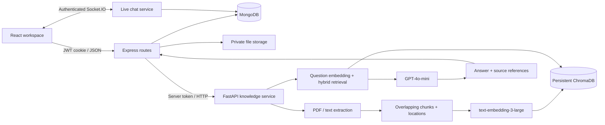

# Second Brain architecture

The original Blog-page MVC layout remains the Node application boundary. React replaces the EJS entry point; the old EJS views remain as reference material and are not mounted. The original comment collection now backs the React story discussion pages. Existing users and blog documents retain their Mongo collection names. Existing salted HMAC passwords upgrade to bcrypt after a successful login. Old JWTs are deliberately invalid because their secret was committed to source control.

## Boundaries

- **React** owns interactions, not authorization. It sends same-origin requests with credentials and a custom request header. JWTs never enter localStorage.
- **Express** checks user identity on every private request. Owner IDs passed to the knowledge service always come from the verified JWT and Mongo user record. The browser cannot select a different owner.
- **MongoDB** persists users, documents, projects, AI conversations, direct-message rooms, messages, and the original blog collection.
- **Socket.IO** validates the cookie at connection time, rejects untrusted browser origins, authorizes each message against room participants, limits event frequency, persists before acknowledging, and deduplicates client message IDs. Expiry and logout close sockets. History is paginated by message ID.
- **FastAPI** is internal. Every endpoint requires the shared service token, including health checks. It creates one Chroma collection per user. Both query and document embeddings use the exact same model. Project filtering happens inside the user's collection.
- **Files** use random server filenames beneath private storage, never a publicly served upload directory. Downloads check document ownership. PDF, Markdown, UTF-8 text, and selected code extensions are accepted up to 10 MB; extracted text is capped at 200,000 characters and PDFs at 300 pages.

## Story publication boundary

Stories default to drafts, including legacy records without a publication state. `/api/public/blogs` queries require `status: published`; private editing endpoints always include the JWT-derived author ID. The public feed paginates nine entries at a time and comments use an ObjectId cursor with 30 entries per page. Search escapes user regex metacharacters. API bodies validate title, body, tags, summary and cover theme.

The editor keeps recovery data in account-scoped sessionStorage and persists explicit saves to MongoDB. A version number and Mongoose optimistic concurrency prevent stale editor saves from silently replacing newer work. Unpublishing removes the story and its comment thread from public reads. Importing a story to knowledge creates an independent private snapshot.

## RAG flow

1. Save a document in MongoDB with `indexing` status and its original file in private storage.
2. Extract selectable PDF text page by page, or decode UTF-8 text/code.
3. Split into chunks of at most 1,800 characters, with 240-character overlap and page/line metadata. Newline boundaries are preferred; there is no AST/function parser.
4. Embed batches of 32 chunks with `text-embedding-3-large`; persist vectors, text and metadata in ChromaDB. Indexing is synchronous and bounded, with a 120-second Express request timeout. Failures leave a readable `failed` record and a retry action.
5. For follow-ups, use GPT-4o-mini to turn recent conversation history into a standalone retrieval query.
6. Embed the query, retrieve up to 20 semantic candidates, collect keyword candidates, and combine rankings with reciprocal rank fusion. This is deterministic rank fusion, not a learned cross-encoder reranker. Keyword-only mode makes no embedding call.
7. Give up to six passages to GPT-4o-mini, explicitly treating retrieved content as untrusted evidence. Ask it to cite claims, acknowledge missing evidence, and avoid inventing personal facts. Remove citation numbers outside the retrieved range. Citations support verification; they do not prove an answer is correct.
8. Save the question, answer, and source excerpts to the user's Mongo conversation. Clicking a source retrieves its current document through the authorized API. Deletion removes the vector index before deleting the file and Mongo record.

## What is deliberately outside this version

GitHub/Drive/Notion connectors, repository cloning and AST analysis, OCR, screenshots, automatic memory extraction, a knowledge graph, voice, agents, MCP, local models, background ingestion queues, and a learned reranker are extension points from the supplied concept, not implemented features. Public publication and comments are implemented through new React pages; the old EJS pages are not mounted.

## Deployment assumptions

This implementation targets one Express instance and one FastAPI worker. For horizontal scaling, add a shared Socket.IO adapter, distributed rate limits and locks, and a durable document-job queue with cancellation and reconciliation. Persistent Chroma uses the mounted local volume. For large libraries, move keyword retrieval to an indexed search service (the current keyword scan is paginated over the user's Chroma collection).

Mongo queries currently return up to 500 documents and 100 conversations in the sidebar. Users cannot edit an indexed document in place: add a replacement, then remove the old source. Password reset, email verification, user blocking, quotas, and account deletion require additional product flows before a public multi-user launch. Use HTTPS, secure cookies, explicit allowed origins, managed secrets, authenticated MongoDB, backups, and a reverse proxy in production. The bundled Compose file is a localhost development deployment, not a hardened public configuration.

## Reference APIs

- [OpenAI embeddings API](https://developers.openai.com/api/reference/resources/embeddings/methods/create)
- [GPT-4o-mini](https://developers.openai.com/api/docs/models/gpt-4o-mini)
- [Chroma collection API](https://docs.trychroma.com/reference/python/collection)
